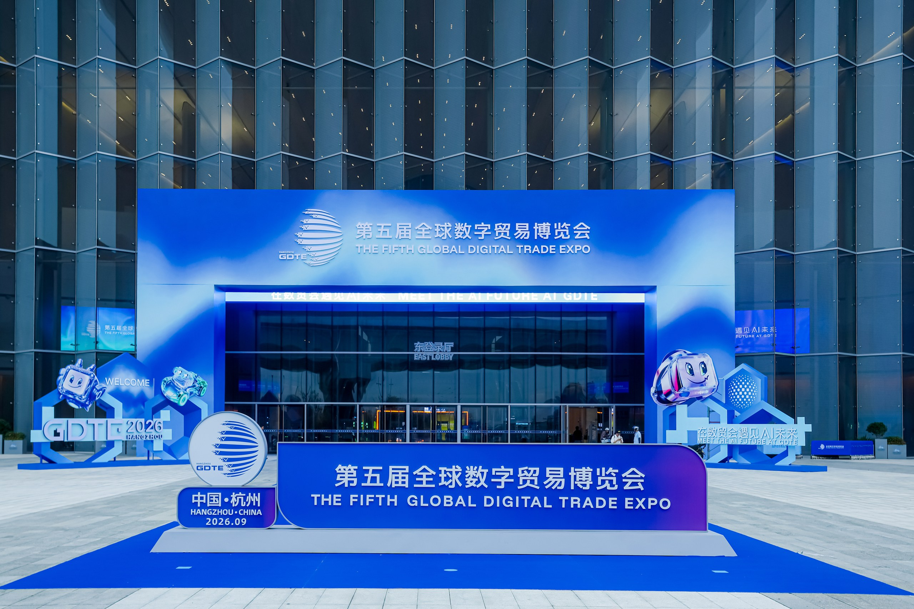
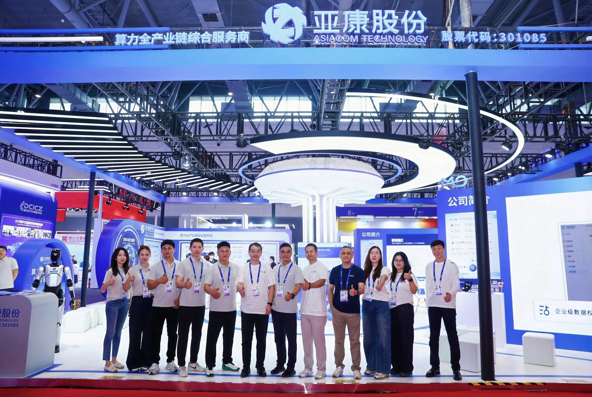
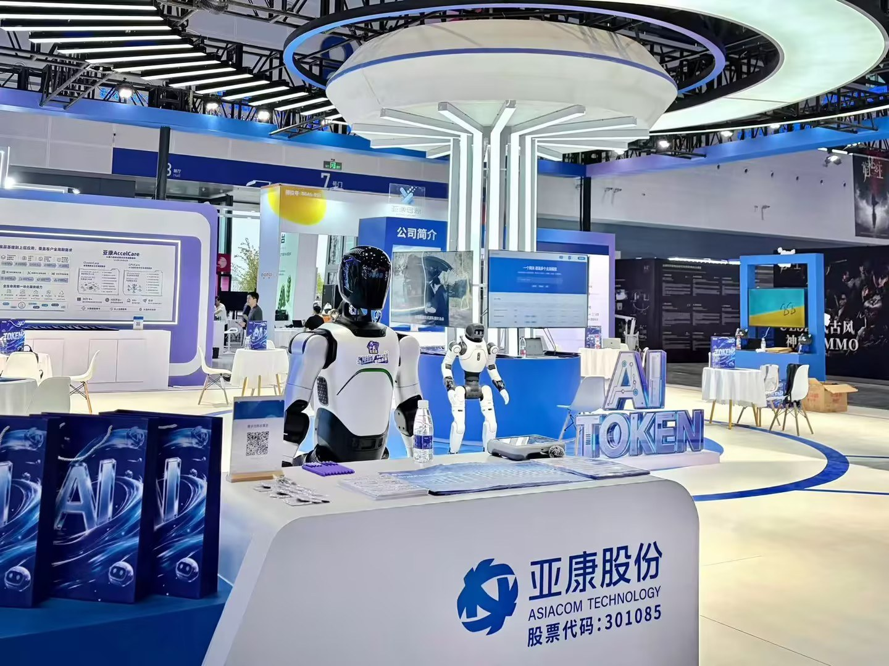
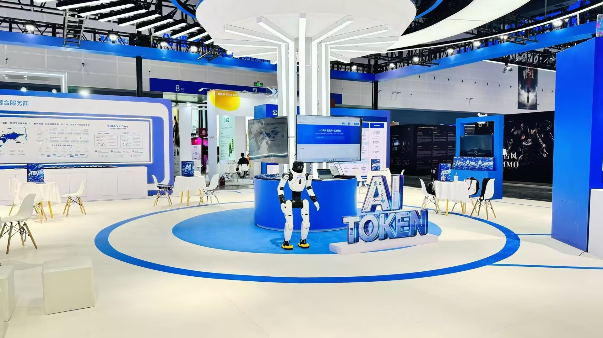
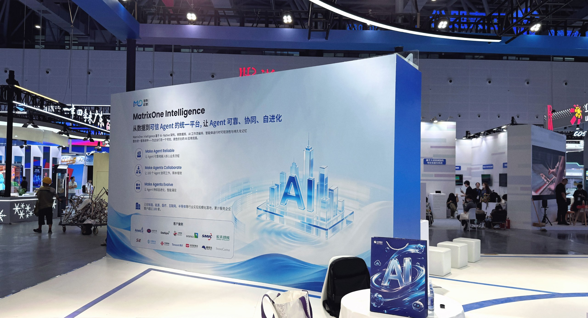
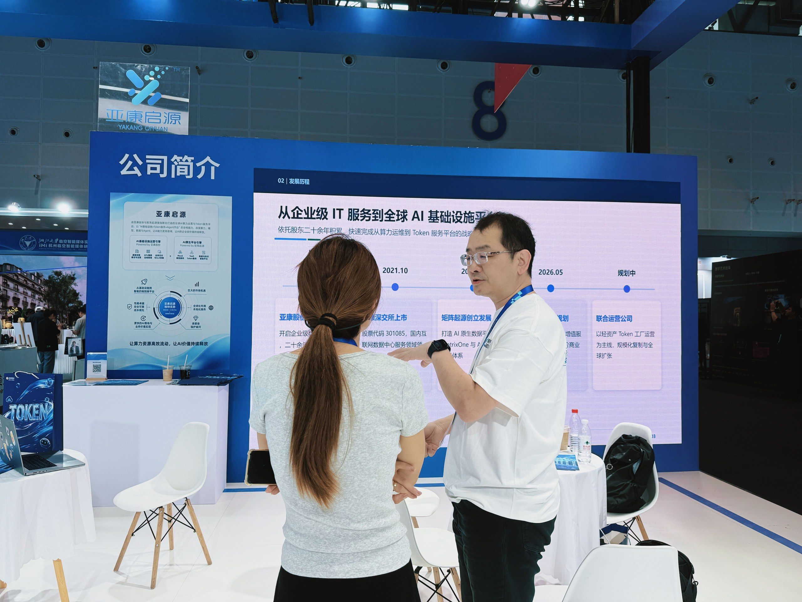
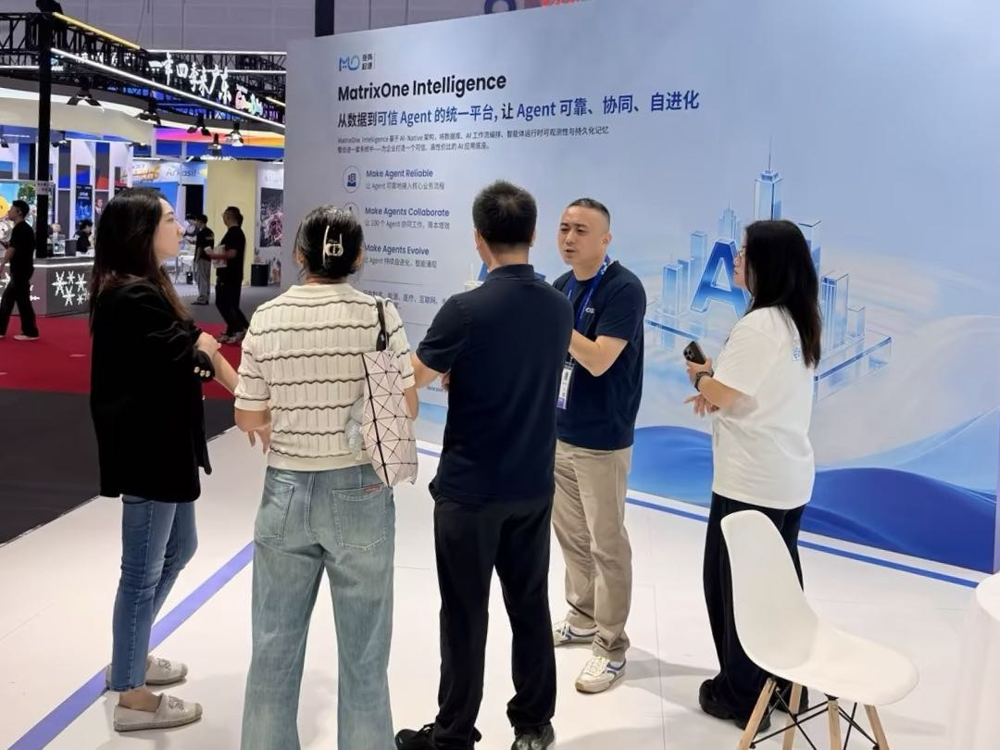
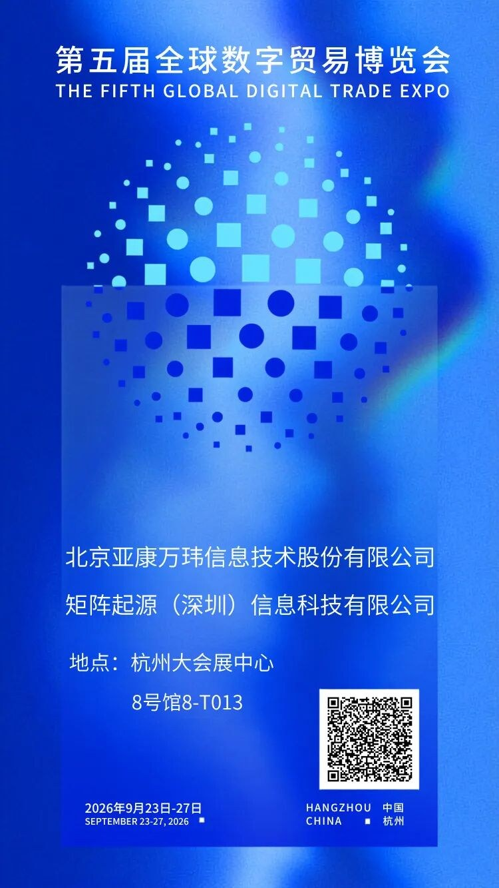

9月23日，第五届全球数字贸易博览会在杭州大会展中心正式启幕。

本届数贸会以“在数贸会遇见AI未来”为年度主题。矩阵起源携手亚康股份、亚康启源亮相8号馆数智文娱展区8-T013展位，围绕算力基础设施、Token服务与企业级智能体应用，与大家共同探索AI与数字贸易融合发展的更多可能。

接下来，跟随我们的镜头，一起看看展会现场。

## 在数智文娱展区，我们带来了这些

从算力设备、数据中心到模型服务和智能体应用，企业AI的落地离不开不同环节的相互衔接。来到现场，您可以沿着“算力基础设施—Token服务—企业级智能体”的路径，了解从底层算力到上层应用的整体链路。

亚康股份带来了覆盖算力全生命周期的服务能力，包括算力设备选型、采购与集成交付，AIDC数据中心部署与运维，以及算力集群运营和模型服务等，为企业AI建设提供稳定的算力基础。

亚康启源连接算力、模型、数据与智能体，围绕“AI基础设施＋Token服务＋智能体平台”，推动算力资源向可计量、可调用、可交付的Token服务转化，为企业应用AI提供更灵活的服务方式。

矩阵起源则带来了企业级AI基础设施及核心产品MatrixOne Intelligence（MOI）的最新进展。MOI围绕数据、运行、记忆、进化和模型服务构建一体化能力，帮助企业连接数据、知识、模型与工具，为企业级智能体进入实际业务提供支撑。

## 现场交流持续展开

展会现场，来自不同领域的客户、合作伙伴和专业观众来到展位，围绕算力基础设施、模型与Token服务、企业数据管理以及智能体应用等话题展开交流。

现场不少观众也带着具体需求而来，大家围绕AI建设和实际应用聊了很多，也碰撞出了不少新想法。

## 展会仍在继续，期待与您相见

第五届全球数字贸易博览会将持续至9月27日。还没有来到现场的朋友，接下来几天仍可前来参观。

欢迎来到杭州大会展中心8号馆数智文娱展区8-T013展位，与我们面对面聊聊您的需求与设想，一起探索AI与数字贸易融合发展的更多可能。

扫描上方二维码报名参观

我们在杭州大会展中心8号馆数智文娱展区T013，期待与您现场相见。
